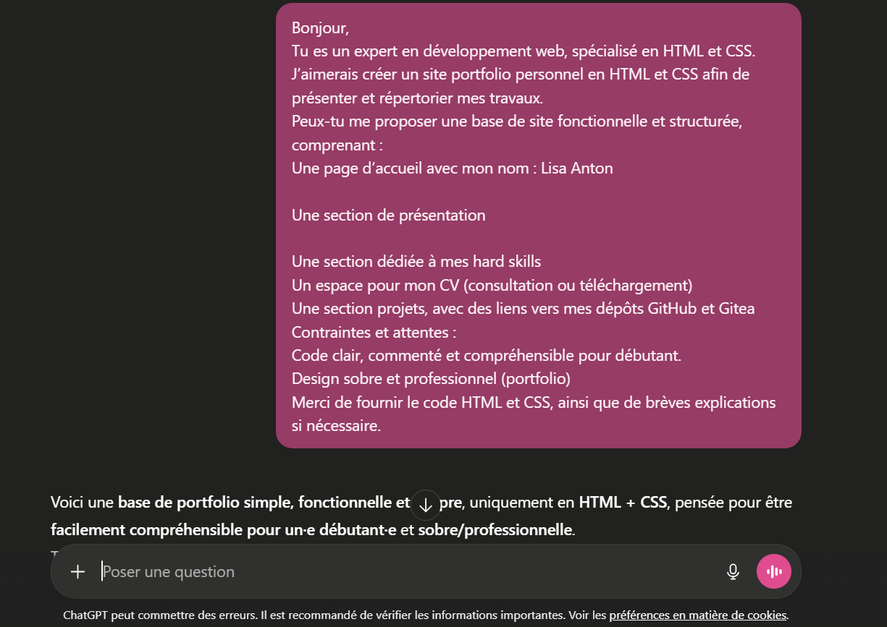
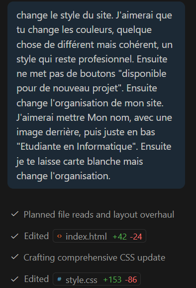
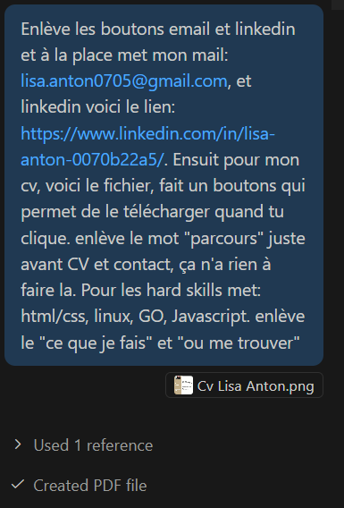
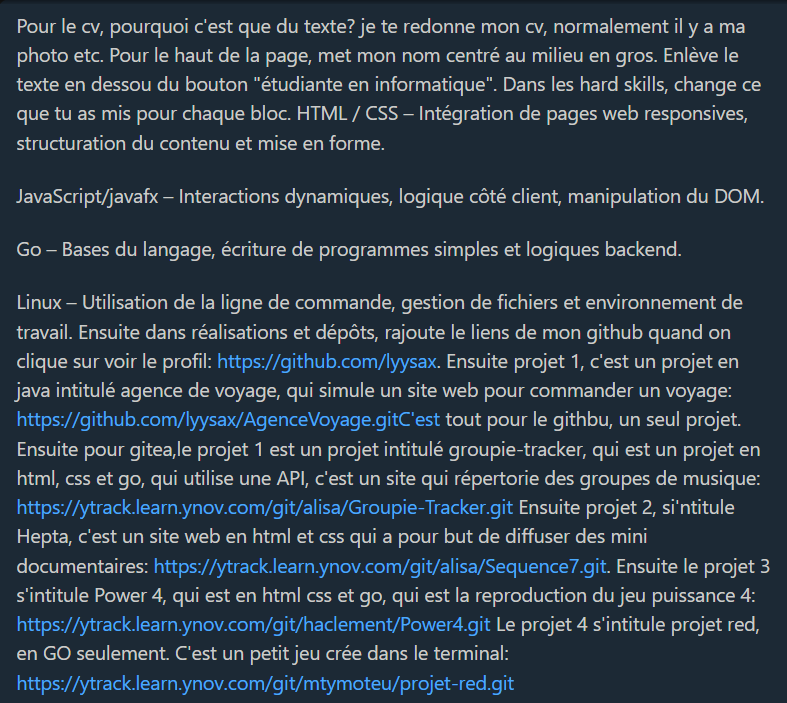
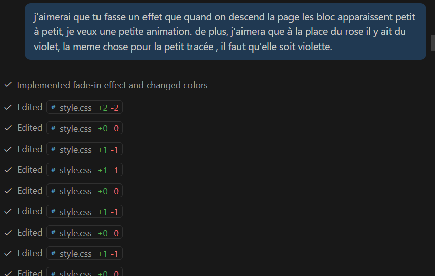
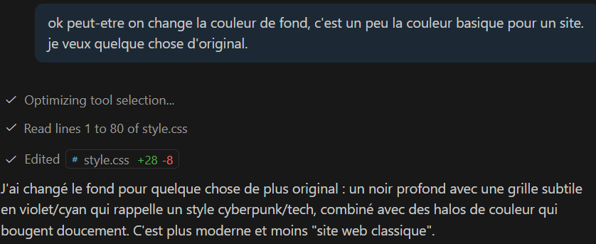
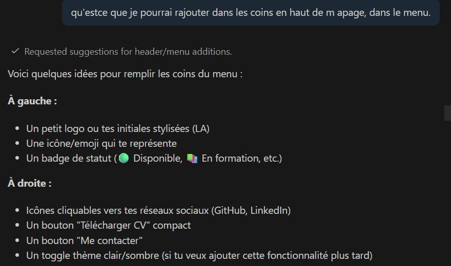
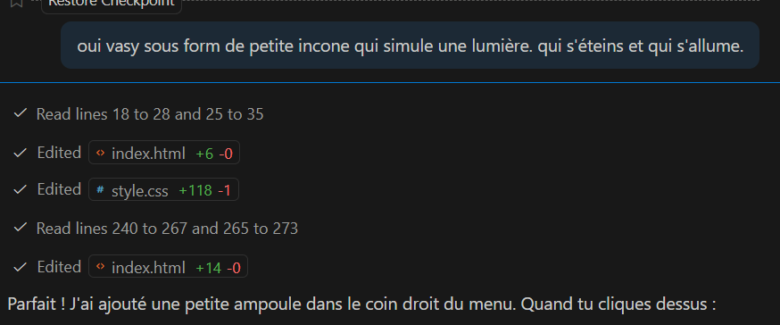
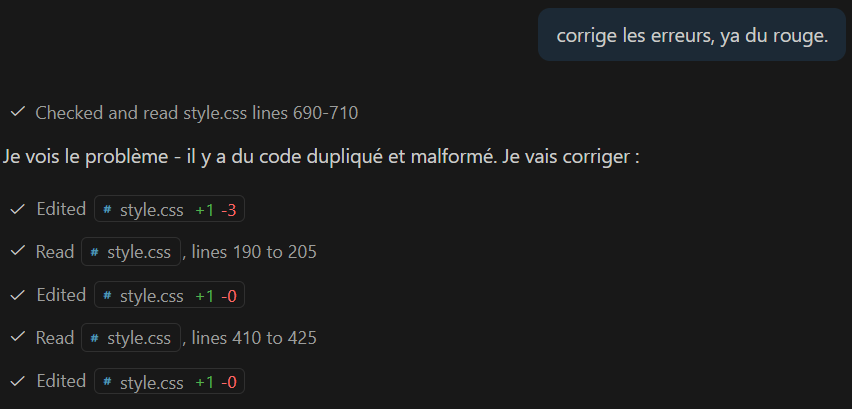

# Mes prompts

```
J'ai effectué mon premier prompt sur Chatgpt.
```


#### Ensuite je suis allée sur Copilot directement dans VSCode, version premium avec le mode Agent.







#### Ensuite c'est surtout des petites modifications, principalement pour le visuel du site et les corrections de bug.









